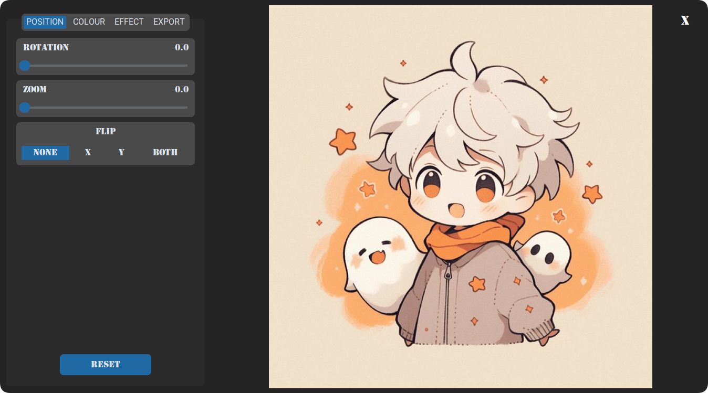
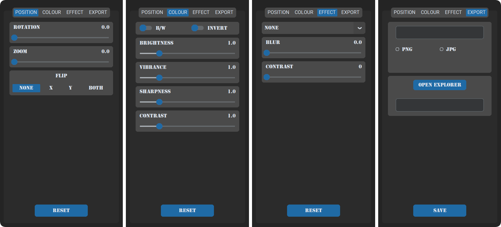
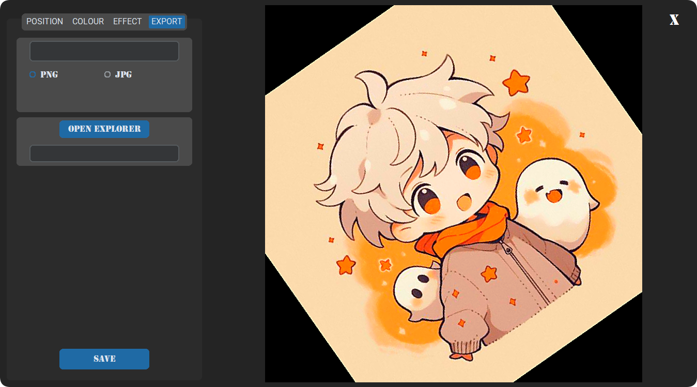

# PHOTO EDITOR GUI APPLICATION

    <em>
        The Photo Editor GUI application delivers an intuitive platform for effortless and advanced image enhancement. Users can swiftly upload their photos and access a comprehensive suite of tools, including precise cropping, resizing, and color correction, making it suitable for both beginners and experienced editors. The application’s extensive range of filters and effects encourages creative exploration while maintaining simplicity. Its streamlined interface ensures a smooth and efficient workflow, allowing users to focus on perfecting their images without interruption. Whether refining subtle details or making bold artistic changes, the application offers a perfect blend of creative flexibility and intuitive design, consistently delivering impressive results.
    </em>

